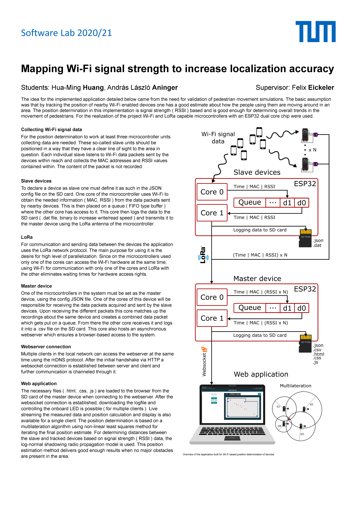

# ESP32WiFiSnifferApp

> An interdisciplinary team project of the course Software Lab at Technical University of Munich (TUM), aiming to map WiFi signals to increase localization accuracy with embedded IoT device ESP32 by tracking the position of nearby WiFi enabled devices. 

  

## Overview

<table>
<tr>
<td>
Please see the documentation [*ESP32WiFiSnifferManual.pdf*](ESP32WiFiSnifferManual/ESP32WiFiSnifferManual.pdf) for instruction in using this software and details about this project.
</td>
</tr>
</table>

## Presentation

(https://drive.google.com/file/d/1OOYYimOC2WSo_yMeU6AgRschL-jhe60d/view?usp=sharing)

